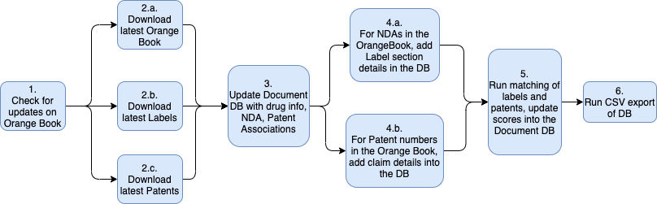

# etl_pipeline
This repo contains the scripts for PharmaDB's ETL pipeline. The results of the pipeline are:
* Updated Drug Labels, Patent Claims and (label to patent) matching scores in a MongoDB database
* A compressed CSV export (in `.zip` format) of the DB

## Periodic Pipeline

### Running the Periodic Pipeline

The script `src/main.py` contains all the logic for periodically retrieving data from the respective data sources and updating the MongoDB database. The following are the steps to be taken.
1. Clone this repo, with the submodules
```
$ git clone --recurse-submodules https://github.com/pharmaDB/etl_pipeline.git
```
2. Build the `node` project for the patent data collection.
```
$ cd src/submodules/uspto_bulk_file_processor_v4
$ npm install
$ npm run build
```
3. Install the Python project dependencies in the submodules. Also, start the file server (for the CSV export download) in the background, from the scoring submodule (more context on this can be found in the [main README](https://github.com/pharmaDB/PharmaDB-README#running-the-pharmadb-back-end-infrastructure)).
```
$ cd src/submodules/dailymed_data_processor
$ pip3 install -r requirements.txt
```
```
$ cd src/submodules/scoring_data_processor
$ pip3 install -r requirements.txt
$ sudo nohup python3 server.py &
```
4. If using a local MongoDB server, the `docker-compose` set up provided in this repo can be used. Follow the steps in the subsequent section to start the server.
5. If NOT using a local MongoDB server, update the `.env` files in the root of this repo and each of the submodules with the host/port (and optionally, the DB name).
6. Run the pipeline script from the `src/` folder using `python3 main.py`. The script can also be run monthly, as a cron job. Eg: `0 0 1 * * python3 main.py`. This can be saved to the cron file using `crontab -e`.
7. Upon successful pipeline run, the data in MongoDB should be updated. As a quick check, the `pipeline` collection should show the updated timestamp for the latest successful run. The CSV export of the DB should also be updated in `submodules/scoring_data_processor/resources/hosted_folder/db2csv.zip`.

### Pipeline Methodology

The pipeline runs a sequence of tasks that can be logically visualized using the following diagram.



However, it may be noted that the pipeline, in its current form, differs from the above depiction in 2 aspects:
* All steps are sequential as opposed to parallel execution for some of the steps
* Step 4.b would save all patents into the MongoDB and not just the ones appearing in the Orange Book.

Both of these may be viewed as future optimizations.

## Running the local Mongo set up
1. Build the docker image using `docker-compose build`
2. Start the containers using `docker-compose up`

### Mongo DB
The Mongo database is exposed at `localhost:27017`. The mongo shell can be accessed, to view / manipulate the data, by exec-ing into the container. Local folder `mongo/data` is attached to the DB container using bind mount, to map to the DB's data folder. This retains the data even when the container is removed.

### Mongo Express
Access `localhost:8081` for the Mongo Express viewer, which provides a limited UI to explore the data in the Mongo DB.

### Clean Up
Run `docker-compose down` to stop and remove all containers.

__NOTE__: The Mongo data should be retained at `./mongo/`.
