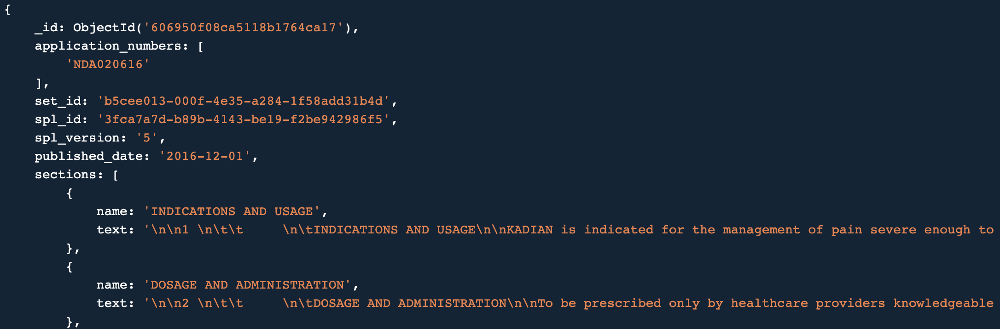
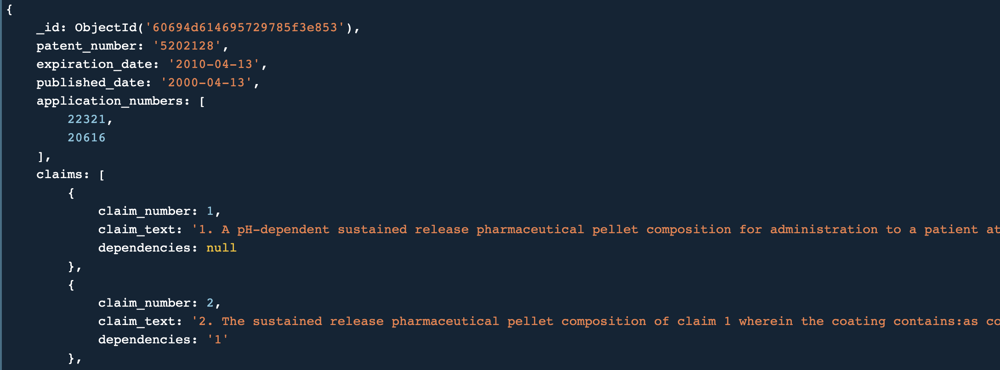
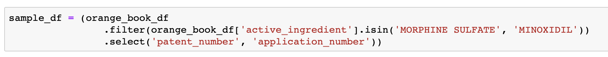
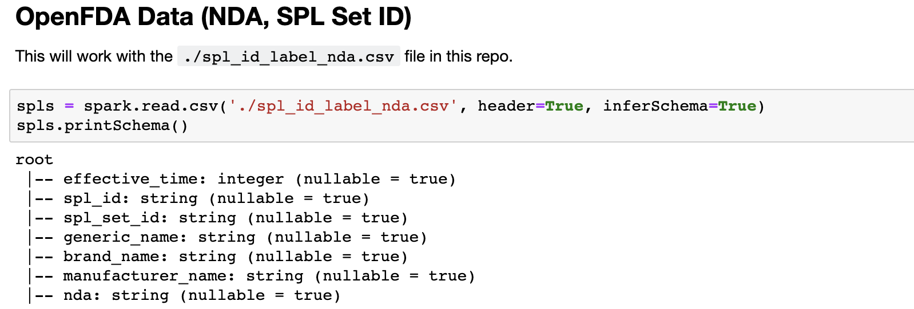
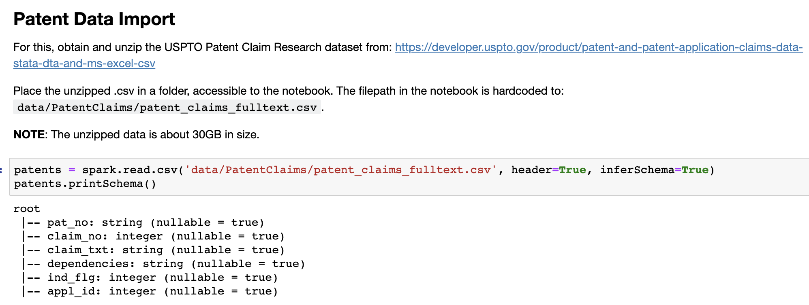
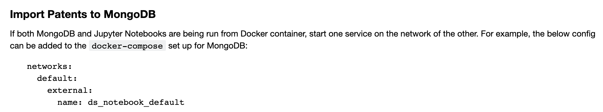

# testdata

This folder contains some test data in JSON format that can be imported directly into a MongoDB instance. Steps are described in detail for generating test data using other drug NDA application numbers.

## Schema

The NDA application number can be found in both collections in the `application_numbers` array field.

### Labels



### Patents



## Importing the JSON Mongo Dump Data

The data covers drugs: `MORPHINE SULFATE`

**Recommended:** Use the docker-compose config in this repo to start up the DB, which is accompanied by the Mongo Express viewer.

The json files include data dumps for the `labels` and `patents` collections, respectively. The `labels` schema is complete, whereas the `patents` currently include only the most critical fields. To import the json data, use the following commands for each collection.

* Copy the JSON file into the Docker container (optional, if the DB runs inside a container).
```
$ docker cp <local_file.json> container_name:.
```

* Import the data (`exec` into the container first, if using Docker).
```
$ docker exec -it container_name sh
$ mongoimport --db <db_name> --collection <collection_name> --file <local_file.json>
```

## Generating Test Data for Other NDA Application Numbers

**NOTE** The `sample_data_EDA_import_mongo.ipynb` notebook at [this repo](https://github.com/pharmaDB/data_analysis/tree/main/ds_notebook/notebooks) contains the supporting code for the steps # 1-4 below. Step #5 exercises the code from the [pharmaDB/dailymed_data_processor](https://github.com/pharmaDB/dailymed_data_processor).

1. Start by selecting the active ingredients.


(This refers to the [Orange Book Association sample data](https://github.com/pharmaDB/data_analysis/blob/main/ds_notebook/notebooks/data/Orange_Book/nber_1985_2016/FDA_drug_patents.csv) that is already available in that repo.)

2. Obtain the Set IDs corresponding to the application numbers from step #1.


(This refers to the [Drug Label set ID to NDA number association](https://github.com/pharmaDB/data_analysis/blob/main/ds_notebook/notebooks/spl_id_label_nda.csv) that is already available in that repo.)

3. Obtain the USPTO [Patent Claim Research dataset](https://developer.uspto.gov/product/patent-and-patent-application-claims-data-stata-dta-and-ms-excel-csv) and place it in the data directory. Fitler the claims linked to the patents from step #1.


(The usage of this dataset is a temporary workaround while we finalize the patent data collection.)

4. Run the last section of the notebook to load the patent info into the configured MongoDB instance.


5. Provide the SPL set IDs from step #2, to download and populate historical label data into the configured MongoDB, based on the steps in [this repo](https://github.com/pharmaDB/dailymed_data_processor).
