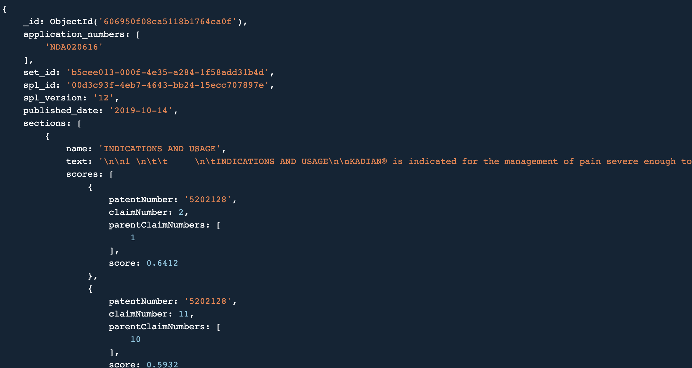

# test Labels with Mock Scores

The `labels_with_dummy_scores.json` file in this folder includes dummy score records in each label section, wherever one of its NDA numbers matches a patent in the [test dataset](../) (2 new patents are missing in the research dataset, some old and expired labels are missing from DailyMed - so not all labels have corresponding patents and vice versa).

So, this leaves us with the following SPL IDs, having a patent association in the test dataset:
```
4e3fa51f-456d-4863-af4b-1e1ae5e59b72
73a25b94-80b8-4505-b97f-011c06157915
00d3c93f-4eb7-4643-bb24-15ecc707897e
c6b5b158-a814-411c-90f2-7a84d8814145
47b14a6d-d22f-4c22-bc55-861b00502928
eba483a8-ccb1-4147-bea8-bc7a9bc6110a
3fca7a7d-b89b-4143-be19-f2be942986f5
f5e0e912-46d8-4bd5-b0d0-34b1f77d1bc4
ac092db4-b7d2-457e-a757-535422a52128
```

Per label section, per matched patent, upto five scores are added at random - i.e., if the label had 2 matching patents (through the NDA number), there would be up to 10 dummy scores on each label section.

## Scores Schema



## Generating more Dummy Scores

The notebook for adding mock scores is available in the [data_analysis](https://github.com/pharmaDB/data_analysis/tree/main/ds_notebook/notebooks) repo: `add_mock_scores_to_mongo_labels.ipynb`